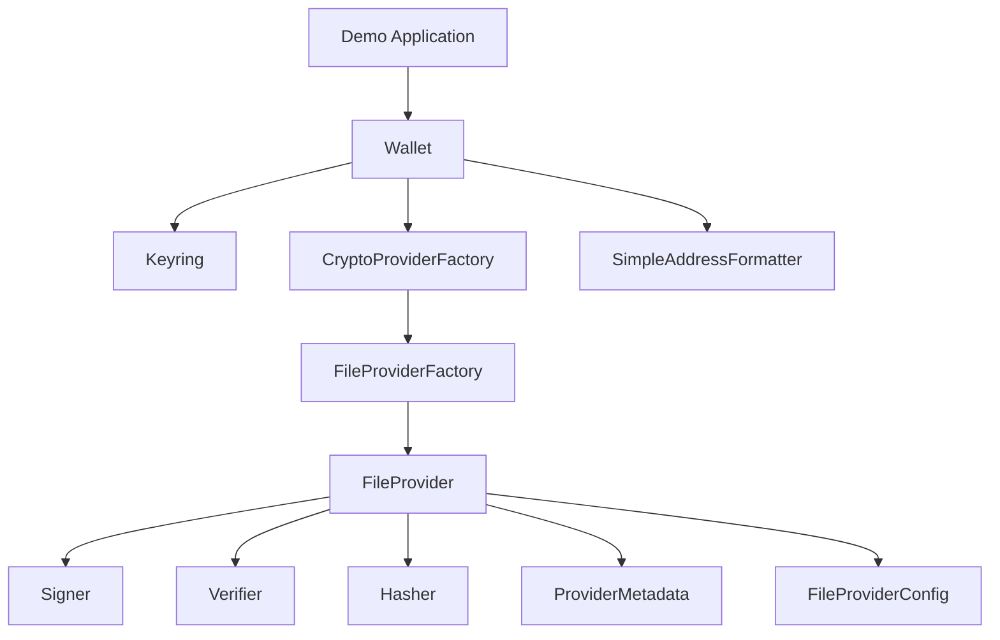

# crypto-provider

<p align="center">
  
</p>

## Overview

This is a Proof of Concept of the crypto-providers ADR as described in the [ADR-001 Crypto Provider](https://github.com/cosmos/crypto/blob/main/docs/architecture/adr-001-crypto-provider.md).

## Main Components

The main components of this project are located in the `components` package. They include:

- **CryptoProvider**: Aggregates functionalities of signing, verifying, and hashing, and provides metadata.
- **CryptoProviderFactory**: A factory interface for creating CryptoProviders.
- **BuildSource**: Various implementations for building CryptoProviders from different sources.
- **ProviderMetadata**: Metadata structure for the crypto provider.
- **Signer, Verifier, Hasher**: Interfaces for signing, verifying, and hashing data.
- **AddressFormatter**: Interface for formatting addresses from public key bytes.

## Running the Demo App

To run the demo app, just type the following command:

```bash
make demo
```

### What the Demo Does

The demo application performs the following steps:

1. Creates a new wallet using an in-memory keyring.
2. Loads a JSON file and creates a new crypto provider from it.
3. Retrieves a signer from the selected provider.
4. Generates random data and signs it using the signer.
5. Retrieves a verifier from the provider and verifies the generated signature.

### Demo Architecture


